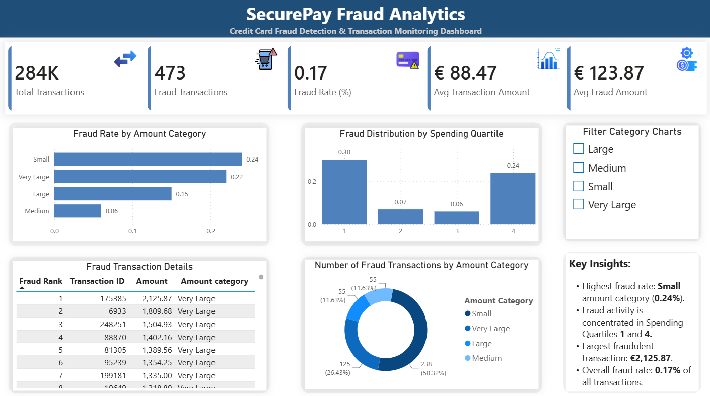

# 💳 SecurePay Credit Card Fraud Analytics

An end-to-end data analytics portfolio project that analyzes credit card transactions to uncover fraud patterns using **Python, PostgreSQL, and Power BI**.

The project follows a complete analytics workflow—from business understanding and data preparation to SQL-based business analysis, dashboard development, and executive reporting.

---

# Project Overview

Credit card fraud is a highly imbalanced business problem where fraudulent transactions represent only a small fraction of total activity. This project demonstrates how data analytics can be used to transform raw transaction data into actionable business insights through exploratory analysis, SQL reporting, and interactive dashboards.

The project emphasizes:

- Data Quality Assessment
- Data Preprocessing
- Exploratory Data Analysis (EDA)
- Feature Engineering
- PostgreSQL Database Design
- SQL Business Analysis
- Power BI Dashboard Development
- Executive Reporting & Documentation

---

## Dashboard Preview



---

# Tech Stack

| Category | Technologies |
|----------|--------------|
| Programming | Python |
| Data Analysis | Pandas, NumPy |
| Visualization | Matplotlib, Seaborn, Power BI |
| Database | PostgreSQL |
| Development | Jupyter Notebook, Git, GitHub |

---

# Project Workflow

```text
Business Understanding
        ↓
Data Quality Assessment
        ↓
Data Preprocessing
        ↓
Exploratory Data Analysis
        ↓
Feature Engineering
        ↓
PostgreSQL Database
        ↓
SQL Business Analysis
        ↓
Reporting Views
        ↓
Power BI Dashboard
        ↓
Business Insights & Executive Report
```

---

# Repository Structure

```text
SecurePay-CreditCard-Fraud-Analytics/
│
├── data/
│   ├── raw/
│   ├── processed/
│   └── README.md
│
├── docs/
│   ├── Business_Questions.md
│   ├── Data_Dictionary.md
│   ├── KPI_Definitions.md
│   ├── Methodology.md
│   ├── Project_Architecture.md
│   └── Project_Roadmap.md
│
├── images/
│
├── notebooks/
│   ├── 01_Data_Quality_Assessment.ipynb
│   ├── 02_Business_Understanding_and_Feature_Planning.ipynb
│   ├── 03_Data_Preprocessing.ipynb
│   ├── 04_Exploratory_Data_Analysis.ipynb
│   └── 05_Feature_Engineering.ipynb
│
├── powerbi/
│   ├── Dashboard_Guide.md
│   └── SecurePay_Fraud_Analytics_Dashboard.pbix
│
├── reports/
│   ├── Business_Insights.md
│   └── Executive_Report.md
│
├── sql/
│   ├── 01_Create_Schema.sql
│   ├── 02_Import_Data.sql
│   ├── 03_Business_Queries.sql
│   └── 04_Create_Views.sql
│
├── .gitignore
└── README.md
```

---

# Key Business Questions

This project answers several business-focused questions, including:

- How common is credit card fraud?
- What is the overall fraud rate?
- Which transaction amount categories have the highest fraud risk?
- How do legitimate and fraudulent transaction amounts differ?
- Which fraud cases should be prioritized for investigation?
- How is fraud distributed across different spending levels?
- Which KPIs best summarize fraud activity for business reporting?

---

# Dashboard Highlights

The Power BI dashboard provides:

- Executive KPI summary
- Fraud rate analysis by amount category
- Fraud distribution across spending quartiles
- Fraud transaction ranking
- Transaction category analysis
- Interactive category filtering

---

# Documentation

Project documentation is organized into dedicated folders.

### Documentation (`docs/`)

- Business Questions
- Data Dictionary
- KPI Definitions
- Methodology
- Project Architecture
- Project Roadmap

### Reports (`reports/`)

- Business Insights
- Executive Report

### Dashboard Documentation (`powerbi/`)

- Dashboard Guide

---

# Dataset

**Dataset:** Credit Card Fraud Detection

The dataset contains anonymized European credit card transactions collected over a two-day period.

**Source**

https://www.kaggle.com/datasets/mlg-ulb/creditcardfraud

> **Note:** The original dataset is not included in this repository due to GitHub file size limitations. Download `creditcard.csv` from Kaggle and place it inside `data/raw/` before running the notebooks.

---

# Key Features

- End-to-end analytics workflow
- Professional project documentation
- SQL-based business reporting
- PostgreSQL database implementation
- Feature engineering
- Power BI executive dashboard
- Reusable SQL reporting views
- Business-focused insights and recommendations

---

# Future Improvements

Potential enhancements include:

- Machine Learning fraud detection models
- Real-time fraud monitoring
- Automated ETL pipeline
- Dashboard performance optimization
- Model evaluation and comparison

---

# Author

**Harasis Singh Batra**

Data Analytics & Data Science Portfolio Project

---

⭐ If you found this project useful, consider starring the repository.