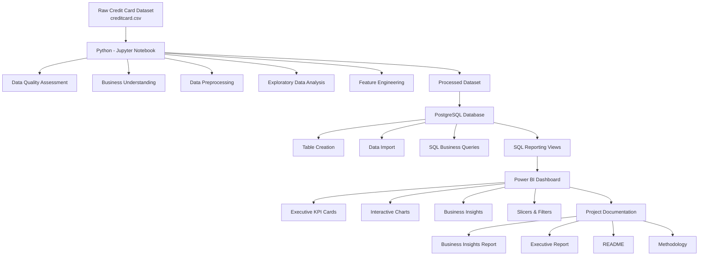

# Project Architecture

## Overview

The SecurePay Credit Card Fraud Analytics project follows an end-to-end analytics workflow that transforms raw transaction data into actionable business insights. The solution combines Python for data preparation, PostgreSQL for data storage and business analysis, and Power BI for interactive visualization and reporting.

---

## System Architecture

---

## Technology Stack

| Layer | Technology |
|--------|------------|
| Programming Language | Python |
| Data Analysis | Pandas, NumPy |
| Data Visualization | Matplotlib, Seaborn |
| Development Environment | Jupyter Notebook |
| Database | PostgreSQL |
| Query Language | SQL |
| Business Intelligence | Power BI |
| Version Control | Git & GitHub |

---

## Workflow Components

### 1. Data Preparation

The raw credit card transaction dataset was examined for data quality issues before being cleaned and transformed into a structured analytical dataset.

---

### 2. Feature Engineering

New analytical features—including **Amount Category**, **Spending Quartile**, and **Log Amount**—were created to improve business reporting and fraud analysis.

---

### 3. Database Layer

The processed dataset was imported into PostgreSQL, where SQL queries and reporting views were developed to generate business insights efficiently.

---

### 4. Visualization Layer

Power BI connects directly to SQL reporting views to present fraud KPIs, transaction distributions, and interactive business dashboards.

---

### 5. Reporting Layer

The analytical findings are communicated through business reports, executive summaries, and technical documentation, making the project accessible to both technical and non-technical stakeholders.

---

## Project Deliverables

The project produces the following deliverables:

- Cleaned and processed analytical dataset
- PostgreSQL database and reporting views
- SQL-based business analysis
- Interactive Power BI dashboard
- Business Insights report
- Executive Report
- Technical documentation
- GitHub portfolio repository